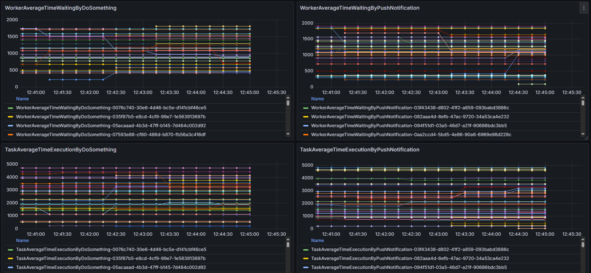

# Запуск
## Запустить docker-compose файл
Если на локальном хосте уже установлена MySQL база данных, то подключение произойдёт к ней,
а не к БД развёрнутой через docker образ. Если это важно, стоит поменять порт в docker-compose.
## Настроить javaagent
Если в конфигурации запуска WorkerAndTaskIntegrationTest поле VM options пустое, то нужно
указать команду: 
-javaagent:./prometheus/jmx_prometheus_javaagent-0.20.0.jar=8080:./prometheus/config.yaml  
## Запуск WorkerAndTaskIntegrationTest::main
После запуска программа может не подключиться к БД, развёрнутой в образе,
может помочь обновление соединения с БД во вкладке Database IDE.
## Вывод данных в Grafana
После запуска приложения, нужно перейти по адресу http://localhost:3000  
Если потребует логин и пароль: admin и admin.  
Далее во вкладке Dashboards должен быть граф с метриками, если его нет, то нужно его создать:  
1) Зайти во вкладку Datasource, выбрать Add data source, выбрать Prometheus.
Указать URL: http://localhost:9090/ или тот порт, что указан в docker-compose.
Нажать на Save & Test.
2) Далее зайти во вкладку Dashboard -> Add Visualisation -> Prometheus.
В поле metricType выбрать метрику с названием org_example_MonitoringJmxMBean_Value.
Должен появится граф с данным. Советую выбрать диапазон времени 5 минут или меньше
## Отображённые данные
